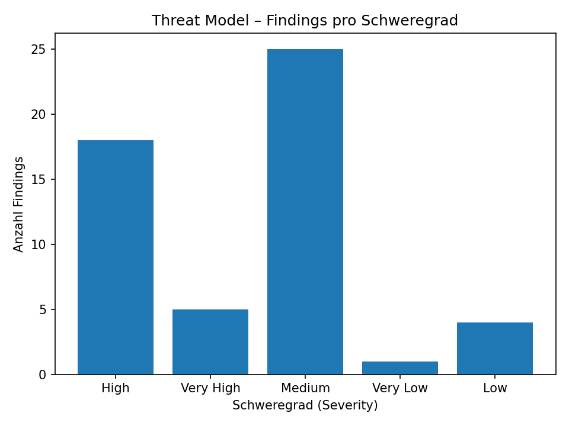

# Secure Python - Threat Modelling Checker

## Run
 2 steps:

- Run a check and create outcome JSON file: `python main_secure.py --json tm_secure.json`
- Plot and analyse outcome JSON file: `python plot_threads.py`

## Output

Example output


```text
Webserver High Server Side Include (SSI) Injection
Webserver Very High Command Line Execution through SQL Injection
Webserver Medium Authentication Abuse/ByPass
Webserver Medium Excavation
Webserver Medium Double Encoding
Webserver Medium Privilege Abuse
Webserver Medium Flooding
Webserver Very High Path Traversal
Webserver Medium Excessive Allocation
Webserver High Format String Injection
Webserver High LDAP Injection
Webserver Medium Parameter Injection
Webserver High Relative Path Traversal
Webserver Medium Input Data Manipulation
Webserver High Dictionary-based Password Attack
Webserver Very Low Footprinting
Webserver Very High Using Malicious Files
Webserver Low Web Application Fingerprinting
Webserver Very High XSS Targeting Non-Script Elements
Webserver Medium Exploiting Incorrectly Configured Access Control Security Levels
Webserver High Embedding Scripts within Scripts
Webserver High PHP Remote File Inclusion
Webserver Medium Principal Spoof
Webserver Medium XSS Targeting Error Pages
Webserver High XSS Using Alternate Syntax
Webserver Low Encryption Brute Forcing
Webserver Medium Manipulate Registry Information
Webserver High Removing Important Client Functionality
Webserver Medium XSS Using MIME Type Mismatch
Webserver High Exploitation of Trusted Credentials
Webserver Medium Functionality Misuse
Webserver Low Fuzzing and observing application log data/errors for application mapping
Webserver High Exploiting Trust in Client
Webserver Medium XML External Entities Blowup
Webserver Medium Session Credential Falsification through Manipulation
Webserver Medium DTD Injection
Webserver High XML Attribute Blowup
Webserver High XSS Targeting URI Placeholders
Webserver Medium XSS Using Doubled Characters
Webserver High SOAP Array Overflow
Webserver Medium HTTP Response Smuggling
Webserver High HTTP Request Smuggling
Webserver High Session Credential Falsification through Prediction
Webserver Very High Session Hijacking - ServerSide
Datenbank Medium Privilege Abuse
Datenbank Medium Excessive Allocation
Datenbank Low Encryption Brute Forcing
Datenbank High Audit Log Manipulation
Save Data Medium Interception
Save Data Medium Content Spoofing
Save Data Medium Sniffing Attacks
Save Data High Communication Channel Manipulation
Save Data Medium Client-Server Protocol Manipulation
```
